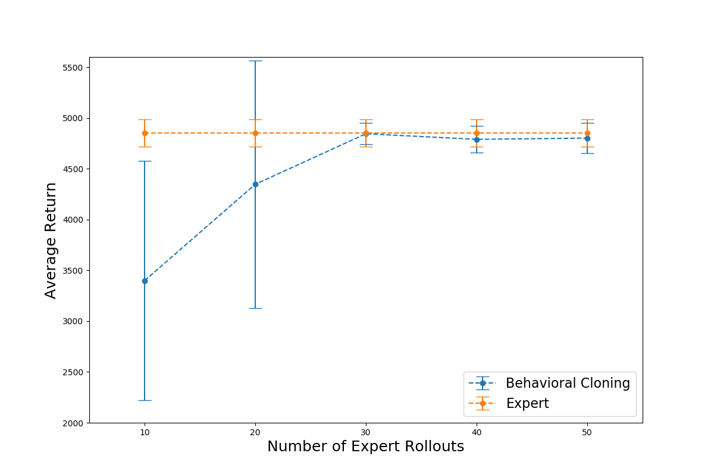
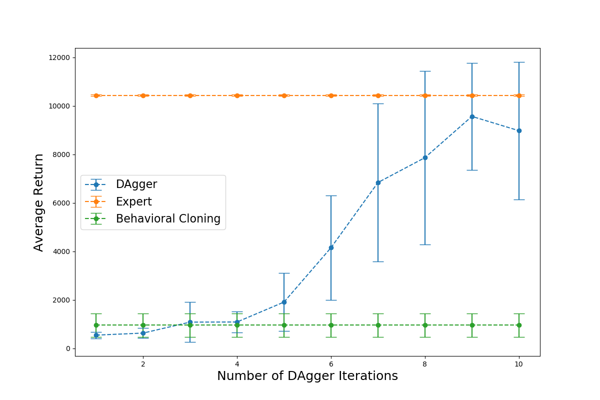

# CS294-112 HW 1: Imitation Learning

In all of experiments below, we use the same network architecture as the expert. 

## Problem 2.2

At the beginning, we get 50 rollouts from the expert, then we let our model do Behavioral Cloning on these data.

In the learning process, we do 50 epochs learning with Adam optimizer (batch size = 64, lr = 0.0001, weight_decay = 0.00001).

Finally, we pick the model that perform best in the training process to be our final model.

To evaluate a model, we run model 10 times in the environment, and calculate the mean and std for total rewards.  

The performance of final model are reported as below.

|   Task name    |   learned model   |      expert      |
| :------------: | :---------------: | :--------------: |
|     Ant-v2     | 4802.01 ± 151.23  | 4851.54 ± 134.09 |
| HalfCheetah-v2 |  4085.17 ± 73.67  | 4095.67 ± 122.68 |
|   Hopper-v2    | 1368.64 ± 215.29  |  3779.60 ± 4.13  |
|  Humanoid-v2   |  954.69 ± 490.10  | 10438.35 ± 39.50 |
|   Reacher-v2   |   -10.12 ± 3.23   |   -4.03 ± 2.37   |
|  Walker2d-v2   | 3305.00 ± 1514.62 | 5515.11 ± 42.41  |

## Problem 2.3

In this part, we only change the nunber of total expert rollouts for Behavioral Cloning algorithm.

For other hyperparameters, we use the same setup as above experiments.

The performance of final learned model with different expert rollouts are reported as below.

## Problem 3.2

Before the DAgger interactions, we first construct our dataset by 30 rollouts from the expert.

After that, we do 20 epochs learning to fit the dataset. (use the same hyperparameters as above)

Then, we run our model in the environment, and get 10 rollouts with expert`s gold actions.

Finally, we add these new rollouts to our dataset, and repeat above process.

The performance of learned model in the different iteration are reported as below.

