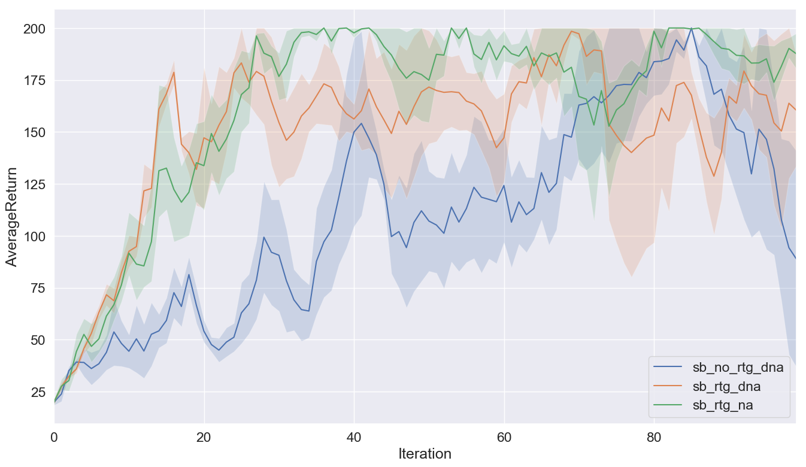
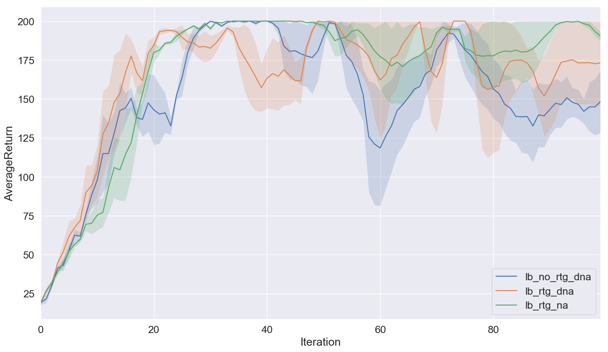
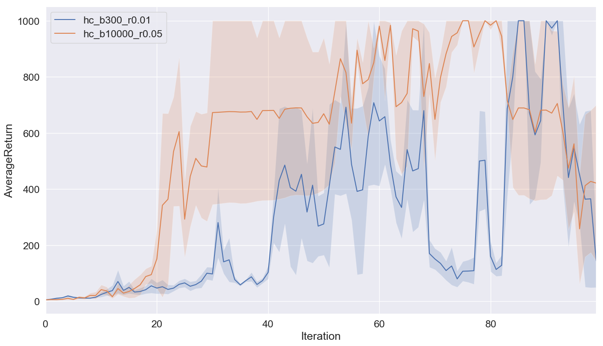
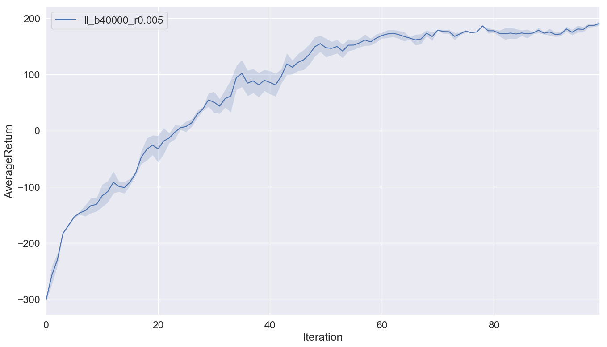
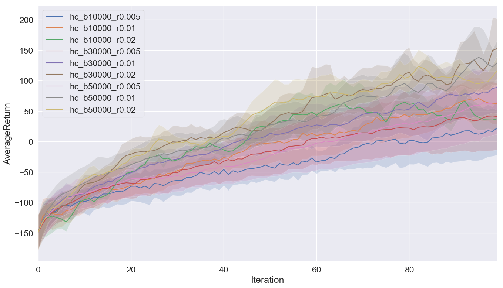
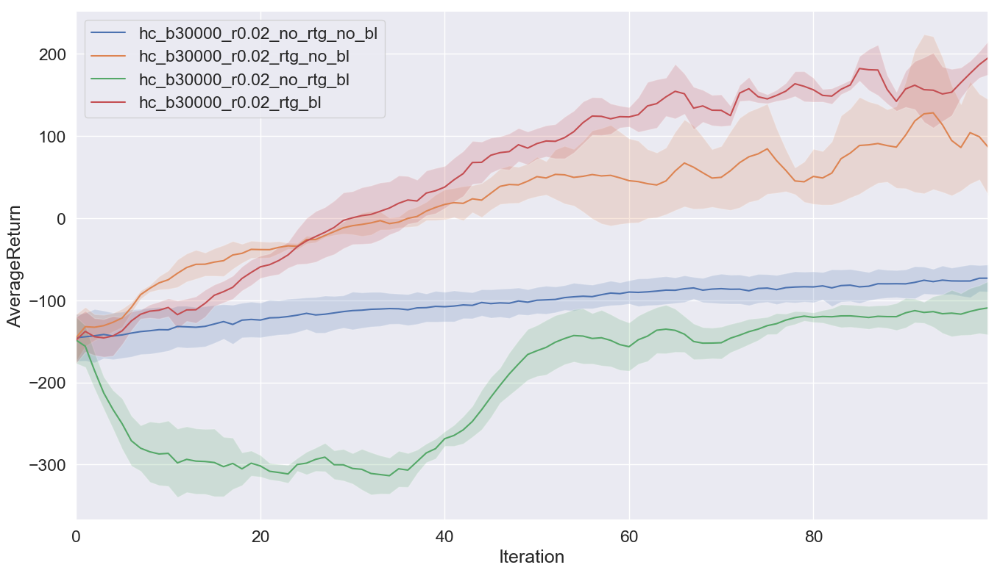

# CS294-112 HW 2: Policy Gradient

## Problem 4: CartPole 

Learning curve for small batch experiments:

Learning curve for large batch experiments:

From the result, we can see that the reward-to-go gradient estimator is better than trajectory-centric one, when advantage-centering is not applied. And reward-to-go one have higher stability, learning speed and average performance.

With the help of advantage centering, reward-to-go gradient estimator became more stable and achieved a better performance in the end.

In addition, if we compare the result between small batch and large batch, we will find that a larger batch size can stabilize and speed up the learning process, which can also guarantee a better performance in the same time.

## Problem 5: InvertedPendulum 

Learning curves for the smallest batch size setting(blue one) and largest learning rate setting(orange one):

The smallest batch size we found was 300(with learning rate = 0.01), and the largest learning rate we found was 0.05(with batch size = 10000).

## Problem 7: LunarLander 

Learning curve for the LunarLander:

## Problem 8: HalfCheetah 

Learning curves for different batch size and learning rate setting:

In general, with the increasing of the batch size, agent can get a higher average performance and a relatively more stable learning process. But in some special case (batch size 30000/50000, learning rate 0.02), a samller batch size can achieve a better final performance. From my point of view, I guess that larger batch size will make agent easier to get stuck in the saddle point with a large learning rate setting, which might hurt final performance. However, it can just because of the unstability of the learning algorithm, which make this special case happened occasionally.

For the learning rate, a larger learning rate can accelerate the learning process, but might also increase the unstability of the learning process. When learning rate is too large, although the learning can be speeded up, the agent will finally converge to a lower performance.

Learning curves for different gradient estimator and baseline setting:

In this problem, using reward-to-go estimator is the key to learn a good policy. Moreover, the neural network baseline might hurt the performance when a wrong gradient estimator is used. But with the use of  the correct gradient estimator, the neural network baseline do help agent to learn a far better policy than before.