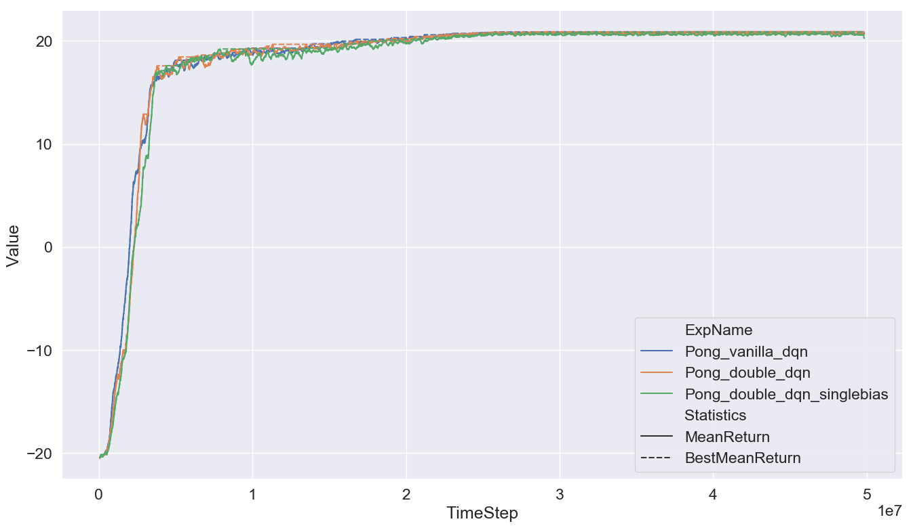
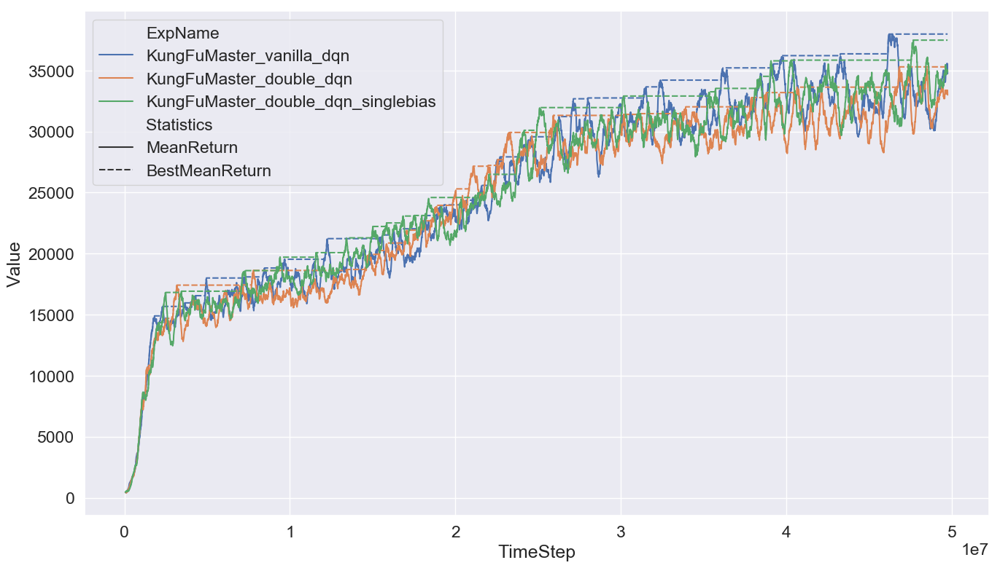

# CS294-112 HW 3: Q-Learning

## Deep Q-learning

In this part, we run our vanilla DQN and double DQN in 4 different atari environments, and we also experimented with the single bias architecture mentioned in original Double DQN paper. 

Here are the results:

### Pong



### Kung-Fu Master



### Bowling


### Asterix


Surprisingly, almost in all 4 environment above, the vanilla DQN model are superior to double DQN model. Even for the single bias variant, the double DQN model can only beat vanilla DQN model in **Bowling** game. From my point of view, I think this might be caused by hyperparameters are not well tuned for the double DQN model. Also, we can find that the final performance of the vanilla DQN in **Asterix** game is far better than reported results in the original Double DQN paper. And this might be another reason why we can not observe the performance improvement of the double DQN model.


## Actor-Critic

### Cartpole 

We run our model on different setting of critic target update frequency and the number of critic gradient step: 


From the results above, we can observe that the actor fail to learn a good policy when the number of critic updates is not enough. Even if  the critic is performed with enough updates, the target update frequency can significantly affect the performance.

We can treat the target update frequency as a kind of trade-off between the learning stability and learning speed. When the target update too fast, the learning process will become unstable. It just like the issue occured in Deep Q-learning, which partially fixed by the target network trick. In the other side, if  the target update too slow, the learning process wiil be slow down, which is unacceptable to us. And also have the risk of overfitting the current sampled mini-batch. All in all, to get a good result, we have to tune this hyperparameter carefully.


### HalfCheetah 

At first, we run our Actor-Critic model with the default hyperparameters, and compare with the Policy Gradient model (with the reward-to-go gradient estimator and neural network baseline) which we implemented in HW2.

Here is the result:


Generally, we can find that the critic network can help, but don't have significant improvement in the final performance. As the instructions says, the critic network might need a different learning rate and more hidden layers or units.  So we tried different learning rate for critic network:


It did help! After that, we also tried adding a hidden layer to the critic network (with the same hidden units), and here is the results:


In the best setting, the performance of the actor do have a notrival improvement.  To make the comparison more clearly, we pick the best setting in 2 hidden layer critic and 3 hidden layer critic respectively, and plot them with the baseline model:


We can clearly see the improvement.

Finally, these are commands for the experiments :

```shell
python train_pg_f18.py HalfCheetah-v2 -ep 150 --discount 0.90 -n 100 -e 3 -l 2 -s 32 -b 30000 -
lr 0.02 -rtg --nn_baseline --exp_name hc_no_critic

python train_ac_f18.py HalfCheetah-v2 -ep 150 --discount 0.90 -n 100 -e 3 -l 2 -s 32 -b 30000 -lr 0.02 --exp_name hc_critic -ntu 10 -ngsptu 10

python train_ac_f18.py HalfCheetah-v2 -ep 150 --discount 0.90 -n 100 -e 3 -l 2 -s 32 -b 30000 -lr 0.02 -clr 0.04 --exp_name hc_critic_clr0.04 -ntu 10 -ngsptu 10

python train_ac_f18.py HalfCheetah-v2 -ep 150 --discount 0.90 -n 100 -e 3 -l 2 -s 32 -b 30000 -lr 0.02 -clr 0.01 --exp_name hc_critic_clr0.01 -ntu 10 -ngsptu 10

python train_ac_f18.py HalfCheetah-v2 -ep 150 --discount 0.90 -n 100 -e 3 -l 2 -s 32 -b 30000 -lr 0.02 -clr 0.004 --exp_name hc_critic_clr0.004 -ntu 10 -ngsptu 10

python train_ac_f18.py HalfCheetah-v2 -ep 150 --discount 0.90 -n 100 -e 3 -l 2 -s 32 -b 30000 -lr 0.02 -cl 3 --exp_name hc_critic_cl3 -ntu 10 -ngsptu 10

python train_ac_f18.py HalfCheetah-v2 -ep 150 --discount 0.90 -n 100 -e 3 -l 2 -s 32 -b 30000 -lr 0.02 -clr 0.04 -cl 3 --exp_name hc_critic_clr0.04_cl3 -ntu 10 -ngsptu 10

python train_ac_f18.py HalfCheetah-v2 -ep 150 --discount 0.90 -n 100 -e 3 -l 2 -s 32 -b 30000 -lr 0.02 -clr 0.01 -cl 3 --exp_name hc_critic_clr0.01_cl3 -ntu 10 -ngsptu 10

python train_ac_f18.py HalfCheetah-v2 -ep 150 --discount 0.90 -n 100 -e 3 -l 2 -s 32 -b 30000 -lr 0.02 -clr 0.004 -cl 3 --exp_name hc_critic_clr0.004_cl3 -ntu 10 -ngsptu 10
```


### InvertedPendulum 

In this problem, we generally did the same thing as above.

Firstly, the baseline models:


Secondly, the different learning rate setting for the critic network:


Also, with one more hidden layer:


Finally, the comparison between baseline and best model:


With the tuning of the learning rate of critic, the learning curve can be more stable and get a little bit performance improvement. However, the extra layer don't help so much as it in former problem. It might because this problem is relatively easy to solve (the beseline model can already reach the max score), or we just have yet to find the appropriate learning rate for the critic.

Here are commands for the experiments :

```shell
python train_pg_f18.py InvertedPendulum-v2 -ep 1000 --discount 0.95 -n 100 -e 3 -l 2 -s 64 -b 5000 -lr 0.01 -rtg --nn_baseline --exp_name ip_no_critic

python train_ac_f18.py InvertedPendulum-v2 -ep 1000 --discount 0.95 -n 100 -e 3 -l 2 -s 64 -b 5000 -lr 0.01 --exp_name ip_critic -ntu 10 -ngsptu 10

python train_ac_f18.py InvertedPendulum-v2 -ep 1000 --discount 0.95 -n 100 -e 3 -l 2 -s 64 -b 5000 -lr 0.01 -clr 0.02 --exp_name ip_critic_clr0.02 -ntu 10 -ngsptu 10

python train_ac_f18.py InvertedPendulum-v2 -ep 1000 --discount 0.95 -n 100 -e 3 -l 2 -s 64 -b 5000 -lr 0.01 -clr 0.005 --exp_name ip_critic_clr0.005 -ntu 10 -ngsptu 10

python train_ac_f18.py InvertedPendulum-v2 -ep 1000 --discount 0.95 -n 100 -e 3 -l 2 -s 64 -b 5000 -lr 0.01 -clr 0.002 --exp_name ip_critic_clr0.002 -ntu 10 -ngsptu 10

python train_ac_f18.py InvertedPendulum-v2 -ep 1000 --discount 0.95 -n 100 -e 3 -l 2 -s 64 -b 5000 -lr 0.01 -cl 3 --exp_name ip_critic_cl3 -ntu 10 -ngsptu 10

python train_ac_f18.py InvertedPendulum-v2 -ep 1000 --discount 0.95 -n 100 -e 3 -l 2 -s 64 -b 5000 -lr 0.01 -clr 0.02 -cl 3 --exp_name ip_critic_clr0.02_cl3 -ntu 10 -ngsptu 10

python train_ac_f18.py InvertedPendulum-v2 -ep 1000 --discount 0.95 -n 100 -e 3 -l 2 -s 64 -b 5000 -lr 0.01 -clr 0.005 -cl 3 --exp_name ip_critic_clr0.005_cl3 -ntu 10 -ngsptu 10

python train_ac_f18.py InvertedPendulum-v2 -ep 1000 --discount 0.95 -n 100 -e 3 -l 2 -s 64 -b 5000 -lr 0.01 -clr 0.002 -cl 3 --exp_name ip_critic_clr0.002_cl3 -ntu 10 -ngsptu 10
```


